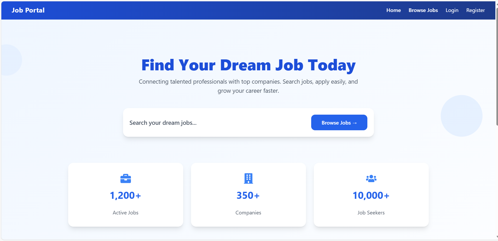
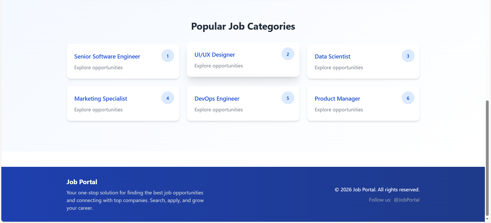
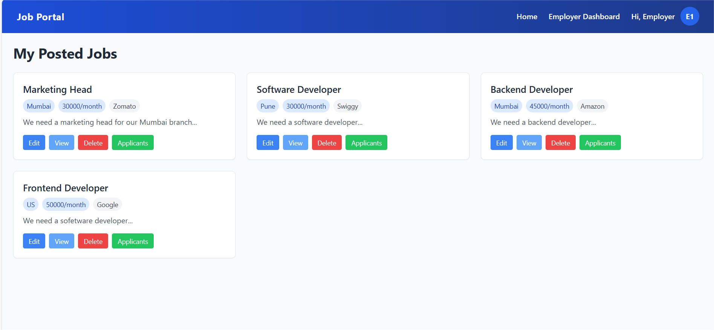
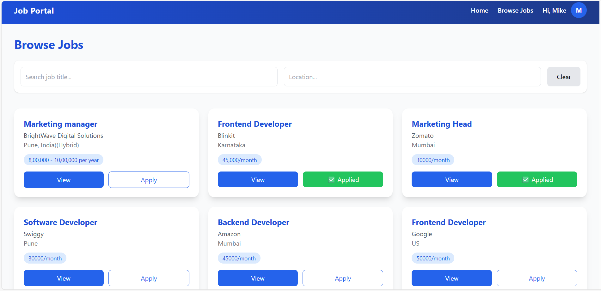
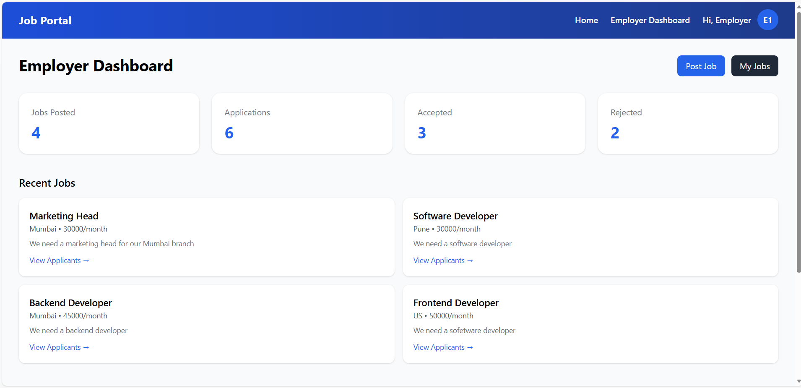

# Job-Listing Portal (MERN Stack)


A full-stack Job-Listing Portal developed during my internship.  
The platform allows employers to post job opportunities and job seekers to apply, manage applications, and track their status.

---

## 🛠️ Tech Stack

- **Frontend:** React.js, Vite, CSS  
- **Backend:** Node.js, Express.js  
- **Database:** MongoDB  
- **Authentication:** JWT (JSON Web Tokens)  

---

## ✨ Features

- Employer & Job Seeker authentication  
- Post, update, and delete job listings  
- Apply for jobs and track applications  
- Responsive UI for web  
- Secure backend APIs  

---

## 📸 Project Preview







---

## 💻 Setup / Run Instructions

1. Clone the repository:

```bash
git clone https://github.com/YOUR_USERNAME/job-listing-portal.git

2. Backend Setup

cd job-listing-portal/backend
cp .env.example .env
npm install
npm run dev

3. Frontend Setup

cd ../frontend
npm install
npm run dev

4. Open the URL shown in terminal to view the project in browser.